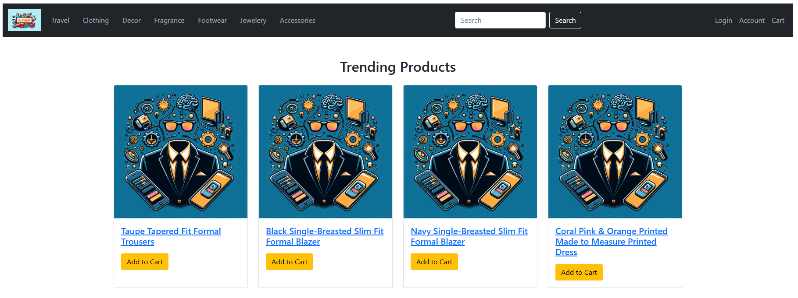
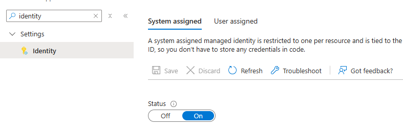

# Exercise 1: Get started with intelligent app development
In this exercise, you will be able to create chat assistant for the retail products to help your customers to learn more about the products. To create the product assistant, the user prompts are sent to the Azure Open AI to complete the chat based on the prompt and the product detail.

**Repo setup**
- Create a fork of the repository.
- In your forked repository, create your Codespaces by clicking on the Code button. Select the "Codespaces" tab and click the button that says "Create codepsace on main".  Your new Codespace will be opened in a new browser tab. Note that will take two to three minutes for the Codespaces container to startup as well as finish installing a few VSCode extensions in the Codespaces container.

 

- View the project code in the Explorer blade inside VS Code Online.  The project code is in the **Exercise-1-IntegrateAOAI folder**.

**Azure OpenAI SDK**
- Go to the [**#region openaichat**](../Exercise-1-IntegrateAOAI/devShopDNC/Controllers/ProductDetailsController.cs#L91) under **Exercise-1-IntegrateAOAI\devShopDNC\Controllers\ProductDetailsController.cs** and view how Azure OpenAI SDK is used to initialize a chat client using Managed Identity to connect to Azure OpenAI.

**Prompt context**
- You can set the prompt context with the product details so OpenAI provides valid responses in relation to the product being queried on.
- Go to the [**#region promptcontext**](../Exercise-1-IntegrateAOAI/devShopDNC/Controllers/ProductDetailsController.cs#L116) under **Exercise-1-IntegrateAOAI\devShopDNC\Controllers\ProductDetailsController.cs** and view the prompt context setting.

**Prompt response style**
- Using the SystemChatMessage class, Azure OpenAI can be instructed to respond in a specific style like Shakespearean, pirate, etc...
- Go to the [**#region systemmessages**](../Exercise-1-IntegrateAOAI/devShopDNC/Controllers/ProductDetailsController.cs#L137) under **Exercise-1-IntegrateAOAI\devShopDNC\Controllers\ProductDetailsController.cs** , comment the current systemmessage and uncomment the line for new systemmessage that has the Shakespearean style response message embedded.
  
**Azure Sign In**
- Log into the provided Azure subscription in your environment using Azure CLI and on the Azure Portal using your credentials.
- In the list of resources, sort by the **Type** column.  This will make it easier to find specific resources later in this lab and the follow-on labs.
- Review the App Service Plan and the Azure Open AI service pre-provisioned in your subscription

### Deploy webapp to Azure App Service
- Right click on devshopDNC.csproj and select Open In Integrated Terminal

  

- **To publish the web app, run the command in the opened terminal, run dotnet publish -c Release -o ./bin/Publish**
- Note:  **Building the application will take around one minute to complete.**

  

- Open the **bin** folder so you can see the **Publish** and Release folders created by running the _dotnet_ command.
- Right click on **bin--> Publish** folder and select the "Deploy to Web App" option.
- Note:  **It may take up to two minutes to publish the application.**

  

- Select the already pre-created webapp for Exercise 1 in the resulting dropdown menu.  In the Build 2025 lab environment the webapp will have a name starting with **devshop**.  For example:  **devshop**_x2ti4z6yps8xy_ (your app name will end with a different set of random characters).
  
  
  
### Run the webapp
- Once the deployment completes, goto the Azure Portal and click on the **devshop** web application to get to the application's Overview page in the Portal.  Then click the Browse button to open the website in the browser.
- Note:  After the prior publishing step, please wait around 30 seconds for the new code changes to be picked up by the platform and take effect.  If you do not seen the home page of the e-commerce application wait a few seconds in between periodic refreshes of the browser.

  

    

### Enabling Managed Identity

- System Identity has been already enabled for your web app. To view, search for Identity on Settings menu. Under System Assigned tab, the Status will be set to **ON**. 

 

- As an optional next step, if you click on "Azure role assignments" you will see (after a little delay) that the web app's "Role Assignment" includes "Cognitive Services OpenAI Contributor" on the Azure OpenAI resource.  That is how the web app is securely authorized to access the Azure OpenAI deployment created in the Lab.

### Connect to Azure Open AI (THIS STEP IS ALREADY DONE FOR YOU IN THIS LAB)

Now, the website is up and running. Lets connect with Azure OpenAI to get the Chat with AI Assistant integrated to the web app to get the information needed for adding appsettings to App Service web app.

- In the Azure Portal, look at the resource group that has been provisioned for the Lab.  Click on the resource that is of type **Azure OpenAI**.  This resource will have a name like **Build2025HOL347**_y4bu5k6yds9xy_ (your resource name will end with a different set of random characters).
- In the Overview blade for the Azure OpenAI resource, click on the button "Go to Azure Open AI Foundry portal" to open the Azure AI Foundry Portal
- Note:  When the resources are pre-provisioned as part of the Build 2025 lab setup, you can just click on "Deployments" in the left-hand menu in the Azure AI Foundry Portal.  You will see the gpt-40-mini deployment that has been created for you.  Clicking on "gpt-4o-mini" brings you to the endpoint details including the model deployment’s Uri and Key.

   

- Deploy the gpt-4o model by going to Deployments and select gpt-4o-mini Chat completion model and click Confirm

 

  

- Give the deployment name and select deployment type as "Global Standard"

  

- Get Model name and Azure AI endpoint (**Only select the protocol and domain name portion of the url, excluding everything else in the Url path starting from the first "/" character**).

 

 

- Switch back to the App Service configuration blade. Add the environment variables AZURE_OPENAI_DEPLOYMENT and AZURE_OPENAI_ENDPOINT. For AZURE_OPENAI_ENDPOINT value, use TargetUri and for AZURE_OPENAI_DEPLOYMENT value, use deployment name retrieved from the above step 

 

### Chat with AI Assistant
- Go to Clothing tab and select a product. 
- Click on **Chat with AI Assistant** and type in an user message like "tell me more about the formal blazer".  Then click the **Submit** button to send the chat message to the gpt-40-mini model to generate a chat response.
- You should receive a chat response from the OpenAI model.

  
### Monitor the webapp
To monitor your web app, you can leverage the LogStream option under Monitoring section on the webapp portal view.

 

