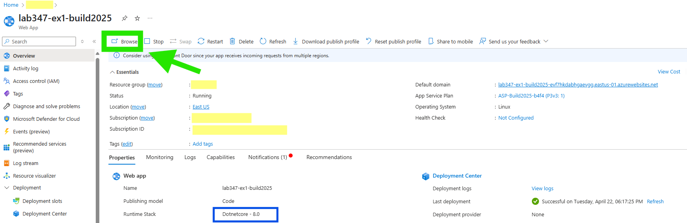
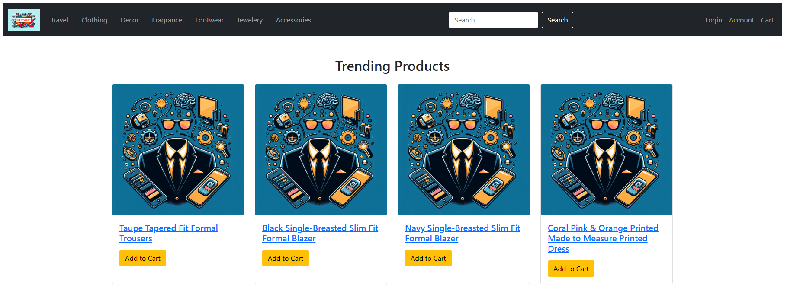
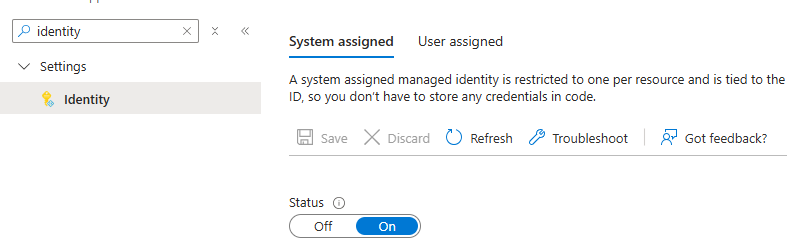
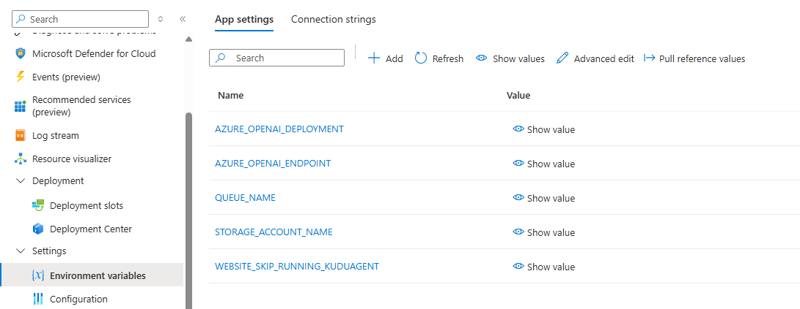
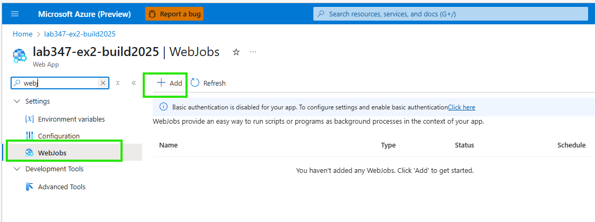
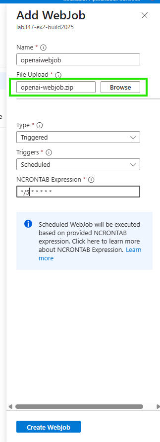
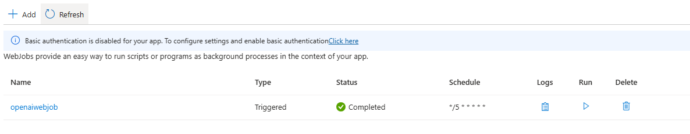
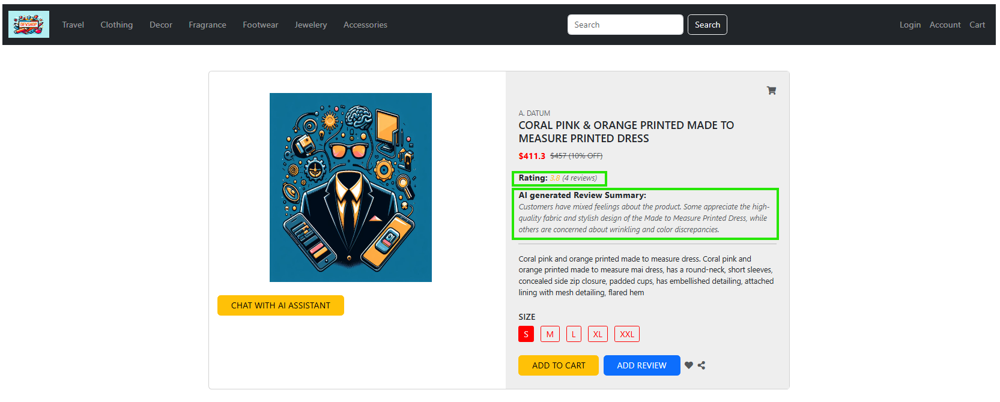
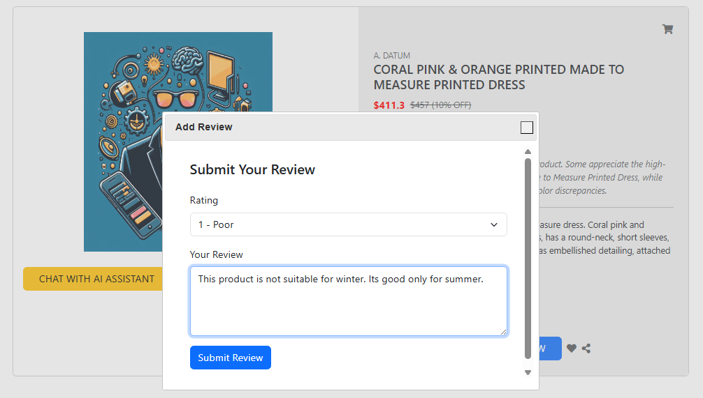
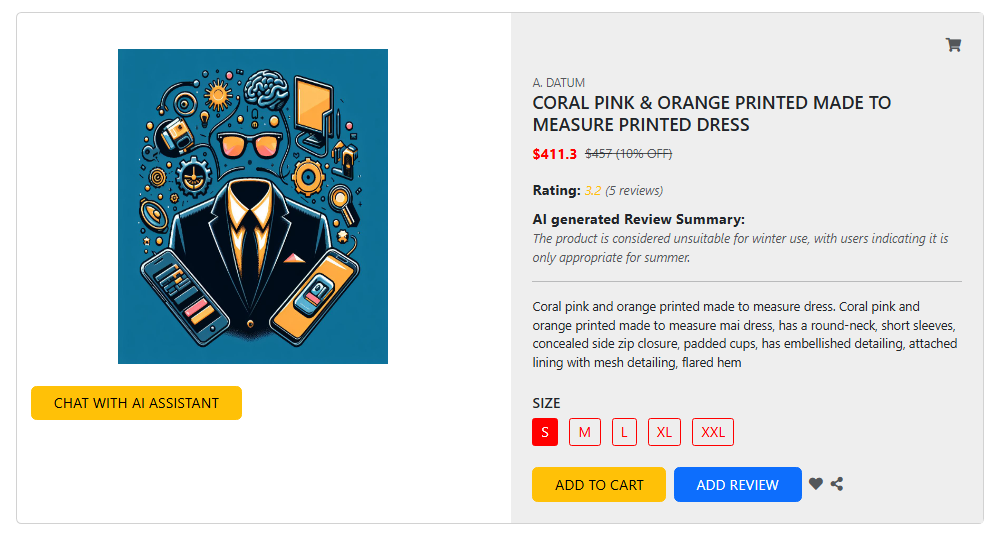

# Exercise 2: Azure OpenAI SDK based Webjob
In this exercise, you will use Webjobs with Azure OpenAI for generating a summary of product reviews.

**App Setup**
- This App uses an Azure Storage Queue leveraging the [Web-Queue-Worker](https://learn.microsoft.com/en-us/azure/architecture/guide/architecture-styles/web-queue-worker) architecture to generate an AI summary for new reviews using Webjobs as a background process.
- Go to [**#region publishreviewtoqueue**](../Exercise-2-WebjobWithAOAI/devShopDNC/Controllers/ReviewController.cs#L85) in **Exercise-2-WebjobWithAOAI/devShopDNC/Controllers/ReviewController.cs** and view how a new review id is published to queue.
- Go to [**#region receivemessagefromqueue**](../Exercise-2-WebjobWithAOAI/ai-webjob-AOAI/Program.cs#L114) in **Exercise-2-WebjobWithAOAI\ai-webjob-AOAI\Program.cs** and view how the Webjob will pop the item from queue.
- Go to [**#region openaichatclient**](../Exercise-2-WebjobWithAOAI/ai-webjob-AOAI/Program.cs#L207) in **Exercise-2-WebjobWithAOAI\ai-webjob-AOAI\Program.cs** and view how Azure OpenAI SDK is used in the webjob to generate an updated AI summary for the product based on prior summaries as well as a newly submitted review.

**Azure Sign In**
- If you have already signed in to Azure, you can skip this step and move to the "Deploy webapp..." section.
- Log into the provided Azure subscription in your environment using Azure CLI or in the Azure Portal using your credentials.
- Review the App Service Plan and the Azure OpenAI service pre-provisioned in your subscription

### Deploy the webapp to Azure App Service
- **You can skip this step if you have already deployed the web application from Exercise 1**. Refer to the [Exercise 1 Lab Instructions](./Exercise-1.md#deploy-webapp-to-azure-app-service) for detailed steps on deploying the web app.
  
### Run the webapp
- Once the web app is deployed, go to the Overview blade in the Azure Portal for the web application and click on the Browse button to view the web app in the browser.

  

  

### Enable Managed Identity

- **The below step can be skipped if you completed Exercise 1**.
- **Optional:**  you can check the last item in this section to see how the Azure Storage account role assignment is configured.

- System Identity has been already enabled for your web app. To view the identity, from the Overview blade for the web application, click on "Identity" in the left-hand menu. Under the System Assigned tab, the Status will be set to **ON**. 

 

- As an optional next step, if you click on "Azure role assignments" you will see (after a little delay) that the web app's "Role Assignment" includes "Cognitive Services OpenAI Contributor" on the Azure OpenAI resource. That is how the web app is securely authorized to access the Azure OpenAI deployment created in the Lab.
- **[NEW]** For the Storage account used in the lab you will see the web app also has a "Role Assignment" set to "Storage Queue Data Contributor". This is needed for the web application to publish review information to an Azure Storage Queue, as well as for the associated WebJob to pop review information from the Azure Storage Queue.

### Connect to Azure Open AI
- **You can skip this step if you have already connected the web app from Exercise 1.** Refer to the [Exercise 1 Lab Instructions](./Exercise-1.md#connect-to-azure-open-ai-this-step-is-already-done-for-you-in-this-lab
) for detailed steps.

### Update Storage Queue details as App Settings (THIS STEP IS ALREADY DONE FOR YOU IN THIS LAB)
- Add STORAGE_ACCOUNT_NAME and QUEUE_NAME as this is required for choosing the appropriate Azure Storage Queue by WebApp and Webjob for communication.
- Add WEBSITE_SKIP_RUNNING_KUDUAGENT as false, this is needed for running Webjobs.

 

### Add the Azure OpenAI based Webjob to WebApp 
- Download the pre-created WebJob zip file from this Lab's repository to your local machine or VM: [Download openai-webjob.zip](../Exercise-2-WebjobWithAOAI/ai-webjob-AOAI/openai-webjob.zip)

- Go to your web app's Overview blade in the Azure Portal, click the "WebJobs" icon on the left-hand menu, and then click the option to "Add" a new WebJob.
 

- Upload the WebJob zip file from your local machine or VM.
- In the "Add WebJob" UX, choose to make the WebJob a **Triggered** WebJob using a **Scheduled** trigger.  Set the NCRONTAB Expression to __*/5 * * * * *__ (run every 5 seconds).

 

 - Note:  It will take 15 to 30 seconds for the webjob upload to complete and show in the Azure Portal blade that lists the WebJobs associated with the web application.
 - You can periodically refresh the WebJob page in the Portal until the WebJob is showing:
 

 - You are all setup now.

### Run the entire setup

- Browse to the e-commerce site running in your browser and choose any product on the site.
- You will see the current AI-generated review summary and an average Rating for the product.
  

 - Click the "Add review" button and submit your own review!
  

- Reload the product details page and see the updated AI-generated review summary as well as the newly computed review rating.
- Note:  You may need to wait a few seconds for the submitted review to be picked up and processed before changes show up on the website.
 

 - You an also go back to the Azure Portal and check the WebJob's logs by clicking on logs link for the WebJob.
