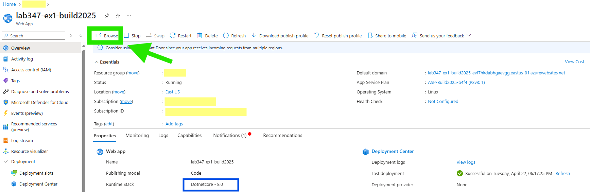

# Exercise 3: Leverage a local Small Language Model (SLM) in a Sidecar from a Webjob 
In this exercise, you will use Webjobs with a local SLM that is running in a Sidecar for creating an AI-generated summary of product reviews.

**App Setup**
- This App uses an Azure Storage Queue leveraging the [Web-Queue-Worker](https://learn.microsoft.com/en-us/azure/architecture/guide/architecture-styles/web-queue-worker) architecture to generate AI summaries for new reviews using Webjobs as a background process.
- Go to **#region publishreviewtoqueue** in **Exercise-1-IntegrateAOAI\devShopDNC\Controllers\ReviewController.cs** and view how a new review id is published to queue.
- Go to **#region localslmendpoint** in **Exercise-3-WebjobWithLocalSLM\ai-webjob-LocalSLM\Program.cs** and see how the local SLM endpoint is a localhost url.
- Go to **#region localslmreceivemessagefromqueue** in **Exercise-3-WebjobWithLocalSLM\ai-webjob-LocalSLM\Program.cs** and view how the Webjob will pop a review item from the queue.
- Go to **#region loclslmopenaichatclient** in **Exercise-3-WebjobWithLocalSLM\ai-webjob-LocalSLM\Program.cs** and view how the Azure OpenAI chat client is used in the WebJob to generate an updated AI summary for the product based on prior summaries as well as a newly submitted review.  Even though the Lab uses the Azure OpenAI SDK, it is calling into the locally deployed Phi-4 SLM.

**Azure Sign In**
- If you have already signed in to Azure, you can skip this step and move to the "Deploy webapp..." section.
- Log into the provided Azure subscription in your environment using Azure CLI or in the Azure Portal using your credentials.
- Review the App Service Plan and the Azure OpenAI service pre-provisioned in your subscription.

### Deploy webapp to Azure App Service
- **You can skip this step if you have already deployed the web application from Exercise 1.** Refer to the [Exercise 1 Lab Instructions](../Exercise-1.md#deploy-webapp-to-azure-app-service) for detailed steps on deploying the app.
  
### Run the webapp
- Once the web app is deployed, go to the Overview blade in the Azure Portal for the web application and click on the Browse button to view the web app in the browser.

  

  

### Enable Managed Identity

- **The below step can be skipped if you completed Exercises 1 and 2.**
- **Optional:** you can check the last item in this section to see how the Azure Storage account role assignment is configured.
- System Identity has been already enabled for your web app. To view the identity, from the Overview blade for the web application, click on "Identity" in the left-hand menu. Under the System Assigned tab, the Status will be set to **ON**. 

 

- As an optional next step, if you click on "Azure role assignments" you will see (after a little delay) that the web app's "Role Assignment" includes "Cognitive Services OpenAI Contributor" on the Azure OpenAI resource. That is how the web app is securely authorized to access the Azure OpenAI deployment created in the Lab.
- [NEW] For the Storage account used in the lab you will see the web app also has a "Role Assignment" set to "Storage Queue Data Contributor". This is needed for the web application to publish review information to an Azure Storage Queue, as well as for the associated WebJob to pop review information from the Azure Storage Queue.

### Add a Local SLM as a Sidecar Extension (THIS STEP IS ALREADY DONE FOR YOU IN THIS LAB)
- Go to Deployment Center for your web application in the Azure Portal. Click on "Interested in adding containers .." banner
 

 - Under "Containers (new)" tab, click on Add and choose "Sidecar Extension".
 

  - Choose "AI: phi-4-q4-gguf (Experimental)" sidecar, given the sidecar a name, and click "Save".
 

 - Click "Refresh" and you will see the Sidecar status as "Running" after a few seconds.
  

- The local SLM will start running in the same network namespace as the main app and will be reachable on http://localhost:11434.  The local SLM will also be reachable over this local network address from any WebJobs associated with the web application.  

### Update Storage Queue details as App Settings (THIS STEP IS ALREADY DONE FOR YOU IN THIS LAB)
- Add STORAGE_ACCOUNT_NAME and QUEUE_NAME as this is required for choosing appropriate Azure Storage Queue by WebApp and Webjob for communication.
- Add WEBSITE_SKIP_RUNNING_KUDUAGENT as false, this is needed for running Webjobs.
- Add SLM_ENDPOINT as http://localhost:11434/v1/ .  This is the localhost endpoint that the WebJob will connect to when calling into the Phi-4 SLM.

 

### Add Local SLM Based Webjob to the WebApp 
- **IMPORTANT:  Go to the WebJobs UX blade for your web app in the Azure Portal and Delete any existing WebJobs.**
- Note:  After deleting the WebJob from the previous exercise, you may need to click an item (any item) in the lefthand menu in the Portal, and then click back into "WebJobs" in order to re-enable the "Add" WebJobs button.
- Download the pre-created WebJob zip file from this Lab's repository to your local machine or VM: [Download local-slm-zip.zip](../Exercise-3-WebjobWithLocalSLM/ai-webjob-LocalSLM/local-slm-zip.zip).  Note this is a *different* zipfile than the one you previously downloaded in Exercise 2.
- Go to your web app's Overview blade in the Azure Portal, click the "WebJobs" icon on the left-hand menu, and then click the option to "Add" a new WebJob.
 

- Upload the WebJob zip file from your local machine or VM.
- In the "Add WebJob" UX, choose to make the WebJob a **Triggered** WebJob using a **Scheduled** trigger. Set the NCRONTAB Expression to __*/5 * * * * *__ (run every 5 seconds).

 

 - Note: It will take 15 to 30 seconds for the webjob upload to complete and show in the Azure Portal blade that lists the WebJobs associated with the web application.
 - You can periodically refresh the WebJob page in the Portal until the WebJob is showing:
 

 - You are all setup now.

### Run the entire setup

- Browse to the e-commerce site running in your browser and choose any product on the site.
- You will see the current AI-generated review summary and an average Rating for the product.
  

 - Click the "Add review" button and submit your own review!
  

- Reload the product details page and see the updated AI-generated review summary as well as the newly computed review rating.
- Note:  Since the AI generated review summary is using an SLM running on general purpose CPUs, it will take a few seconds for the new summary to be generated.  You may want to wait upwards of 15 seconds before refreshing the product details page to see the new review summary.
 

 - You an also go back to the Azure Portal and check the WebJob's logs by clicking on logs link for the WebJob.
