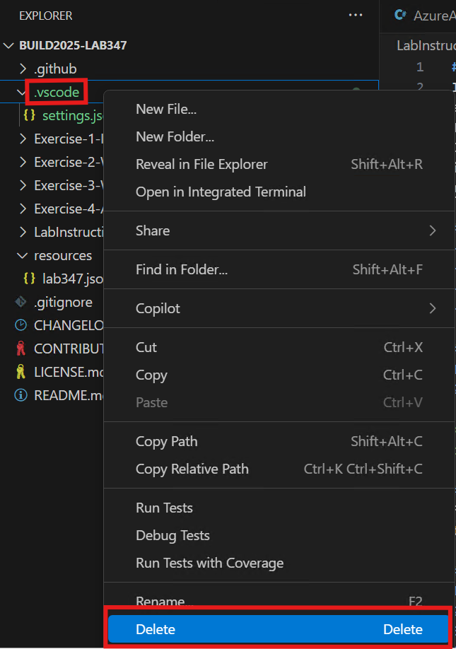
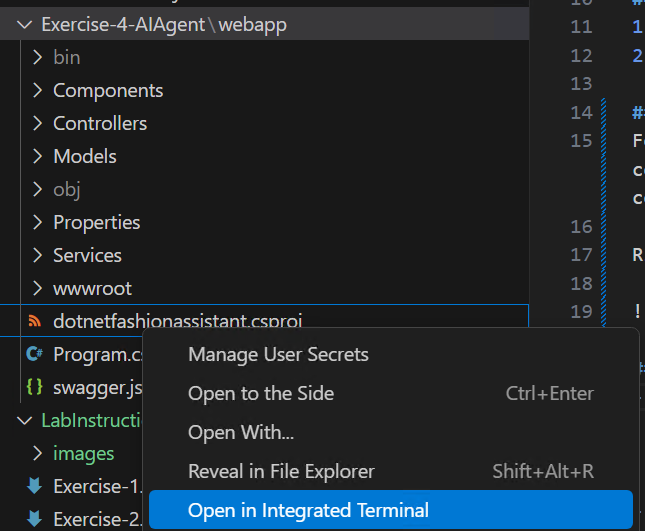
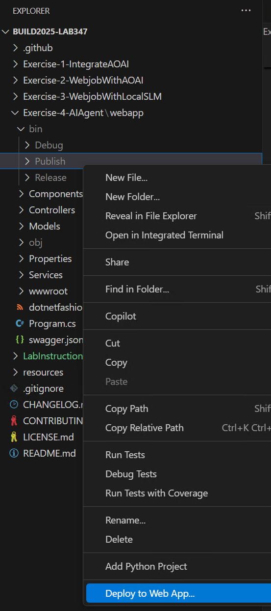
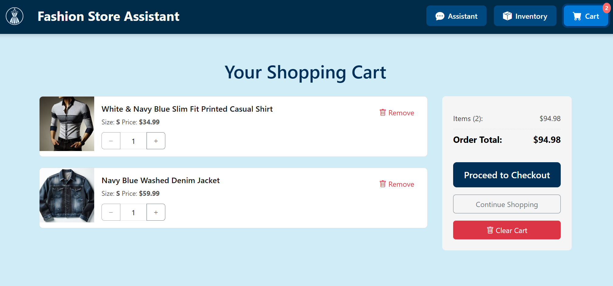
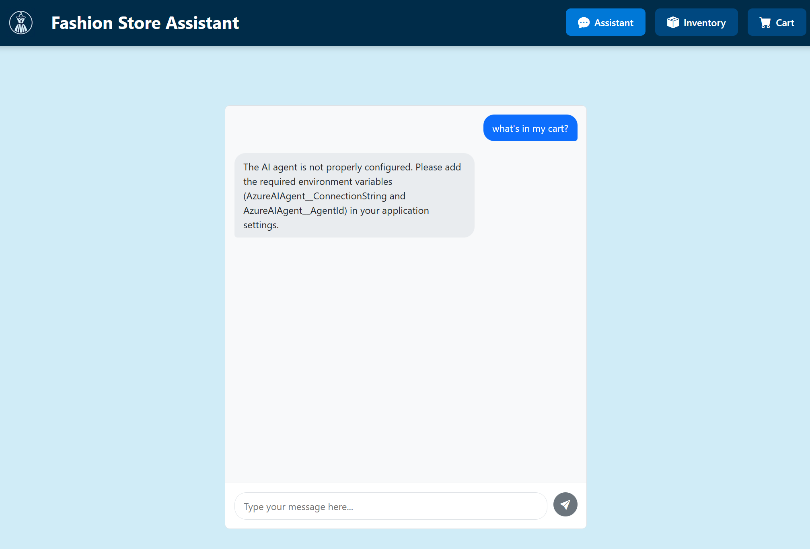
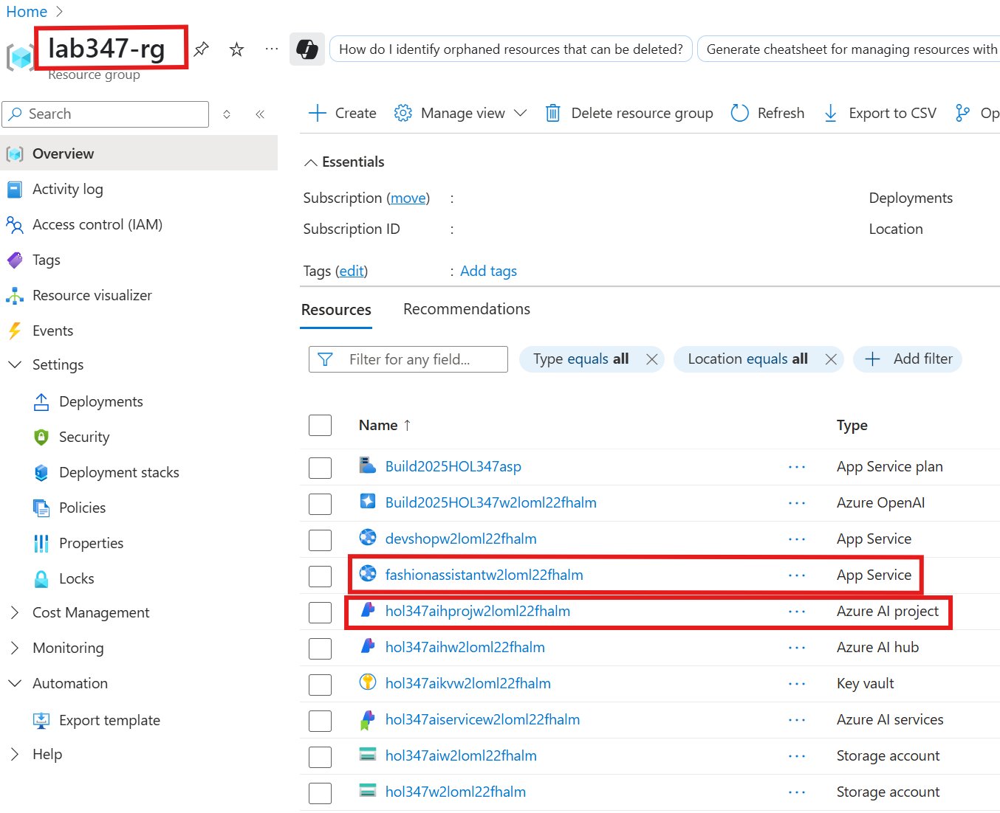
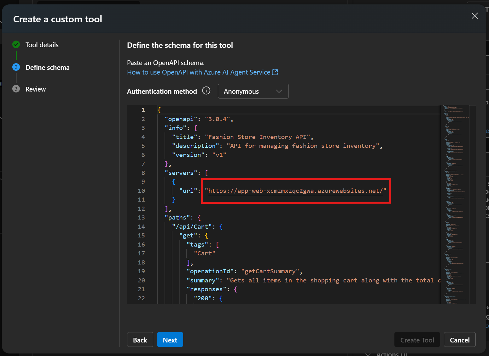
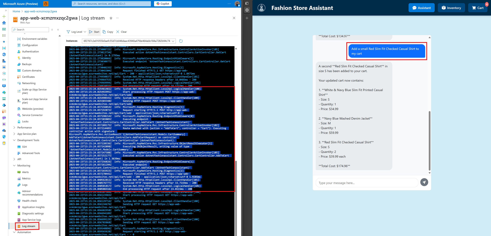

# Exercise 4: Use an Azure AI Agent and the OpenAPI Specified Tool with an App Service App
In this exercise, you will connect an Azure AI Agent from the [Azure AI Agent Service](https://learn.microsoft.com/azure/ai-services/agents/overview) to an App Service app. The app builds off of the Fashion Store Assistant app in the previous exercise, and shows you an alternative way of integrating AI functionality into your apps. The app for this exercise has basic shopping cart functionality and includes an API with an OpenAPI specification for shopping cart management. The Azure AI Agent is given an OpenAPI spec to APIs running in the web app so the Azure AI Agent can handle product recommendations, shopping assistance, shopping cart management, and more on your behalf via a chat interface. This sample builds off of the guidance documented by the AI Agent Service in [How to use Azure AI Agent Service with OpenAPI Specified Tools](https://learn.microsoft.com/azure/ai-services/agents/how-to/tools/openapi-spec?tabs=python&pivots=overview).

## Architecture Overview
- Interactive Blazor UI for fashion e-commerce
- Integration with Azure AI Agent Service for intelligent shopping assistance
- Sample usage of the OpenAPI Specified Tool with Azure App Service
- Secure authentication to Azure AI Agent Service with Azure managed identity

## Prerequisites
1. App Service app with Fashion Store app deployed (provided)
2. Azure AI Foundry Project (provided)

## DO NOT SKIP THIS STEP - Delete the .vscode directory from the Codespace
For this exercise, you will be using a different web application and deploying it into App Service. To ensure the deployment for this exercise points to the correct application in Azure, you must delete the `.vscode` directory that may have been generated during Exercise 1. This directory contains a config file that points all VS Code deployments from this workspace to the first web application in the Lab. If this directory was not created, you can skip this step.

Right-click on the `.vscode` code directory and select **Delete**.



## Deploy the Fashion Assistant application to Azure App Service
- Navigate to the **Exercise-4-AIAgent** folder in VSCode.
- Right click on **dotnetfashionassistant.csproj** in the **Exercise-4-AIAgent\webapp** directory and select **Open In Integrated Terminal**.

    

- To publish the web app, run the following command in the terminal.
- Note:  **Building the application may take 30 seconds to one minute to complete.**
    
    ```bash
    dotnet publish -c Release -o ./bin/Publish
    ```

- Open the **bin** folder so you can see the **Publish** and Release folders created by running the _dotnet_ command.
- Right click on **bin--> Publish** folder and select the **Deploy to Web App...** option.
- Select the provided subscription and the pre-created webapp for Exercise 4 in the resulting dropdown menu. The name of this web app is in the format `fashionassistant<random-id>`.
- Note: **It may take up to two minutes to publish the application.**

    

### Run the webapp
Once deployed, goto the Azure Portal and click on the **fashionassistant** web application to get to the application's Overview page in the Portal. Then click the **Browse** button to open the website in the browser.

Note: After the prior publishing step, please wait around 30 seconds for the new code changes to be picked up by the platform and take effect. If you do not seen the home page of the fashion assistant application, wait a few seconds in between periodic refreshes of the browser.

Visit the Inventory and Cart pages in the app and feel free to add some items to your cart to see how the app works.



If you try to use the Assistant at this point, you receive an error message indicating that you need to connect your agent to the app.



## Create the Agent in the Azure AI Agent Service

To simplify this lab, we've provided a script that will do the following actions for you:

- Create the agent in the AI Agent Service.
- Add the OpenAPI Specified tool to the agent.
- Update your app's environment variables with the agent's ID.

To run the script, follow these steps:

1. Open [create-agent.sh](../Exercise-4-AIAgent/create-agent.sh) in the **Exercise--4-AIAgent** folder and familiarize yourself with the contents. You will see that we are using the [swagger.json](../Exercise-4-AIAgent/swagger.json) for the OpenAPI Specified tool for the agent. Feel free to get familiar with the swagger specification to understand what the API can do.
2. Provide values for the three environment variables at the start of the script on lines 4-6.
3. The three environment variables you need to provide values for are **RESOURCE_GROUP_NAME**, **APP_SERVICE_NAME**, and **AI_PROJECT_NAME**.
4. In the Azure Portal, click into the Overview blade of the resource group created for this lab.  For ease of use, sort the resource view on the **Type** column. You can find your resource group name, App Service name, and Azure AI Project name by looking in the list of resources for the resource group. For the Azure AI Project name, be sure to use the Azure AI **Project** resource, not the hub or the service resource. Note the values in the following screenshot are samples and your values will be different.

    

4. Save your changes to the `create-agent.sh` script and go back to your terminal window.
5. Ensure you're using a Bash terminal. Be sure you are in the **Exercise-4-AIAgent** directory, which is where the `create-agent.sh` script is located.
6. Run the following command to make the script executable.

    ```bash
    chmod +x create-agent.sh
    ```

7. **IMPORTANT**: If you haven't done so already as part of a previous exercise, login to the Azure CLI. This is necessary to obtain an authentication token from Azure so the shell script succeeds. Run the following command and then follow the prompts in the terminal.

    ```bash
    az login
    ```

8. Now run the script.

    ```bash
    ./create-agent.sh
    ```

If you followed all of the steps, you'll get a success message stating "Successfully created agent and updated app settings with Agent ID...". At this point, setup for the agent is complete and your app is updated with the agent ID.

## (OPTIONAL): Generate your own OpenAPI specification
For this sample, the OpenAPI specification was provided. If you want to create your own OpenAPI specification, GitHub Copilot for VS Code can help with that. The following is an example of how you can prompt Copilot to generate the OpenAPI specification for you using Agent mode. The Azure AI Agent Service requires each operation to have an "operationId", so that is also mentioned in the prompt. 

> **NOTE**  
> You may need to make additional updates and revisions to the generated OpenAPI specification in order for the Azure AI Agent Service to accept it. This includes updating the URL as was done in the instructions above. For more information on the requirements, review the [provided sample](../Exercise-4-AIAgent/swagger.json) or go to the [documentation](https://learn.microsoft.com/azure/ai-services/agents/how-to/tools/openapi-spec?tabs=python&pivots=overview).

```
Can you generate an OpenAPI specification for the two controllers for inventory and cart actions? Include an operationId for each operation that clearly indicates what each operation does.
```


Once created, you can re-run the create-agent script to create a new agent with your new OpenAPI specification. Be sure to update the _create-agent.sh_ script on line 125 if your specification uses a different file name.

## Use the app

> **NOTE**  
> The app will restart after running the create-agent script. You may need to give the app up to 5 minutes to restart and be ready to serve requests.

<!-- ## Step 1: Create the Agent in the Azure AI Agent Service
1. In the [Azure Portal](https://portal.azure.com), go to your **Resource group** where all of the pre-created lab resources are located.
2. In the list of resources, find the resource with type **Azure AI project**. Click on that resource. The name will be different than what is shown in the following screenshot.

    

3. On the next screen, click on **Launch studio** to open the Azure AI Foundry Studio.
4. On your local machine, open up **Notepad** or a location where you can copy and paste a couple things which will be needed to connect your agent to your app.
5. On the right-hand side of the Azure AI Foundry, you'll find your **Project connection string**. Copy and paste this entire string into your Notepad for use later.

    

6. You are now going to create the agent. On the left-hand menu, click **Agents**.
    
    

7. On the next screen, click **+ New Agent**. An agent will appear in the table on the screen.
8. Copy and paste the agent's **ID** into your Notepad for use later.

    

## Step 2. Configure the Agent with the OpenAPI Specified Tool
1. In the **Setup** menu, copy and paste the following **Instructions** for the Agent. These are general instructions for your agent to give it some context on its role and purpose. This is also where you can include guidance to the agent to stick to certain context - such as only answering questions about the fashion store and not unrelated topics.

    ```
    You are an agent for a fashion store that sells clothing. You have the ability to view inventory, update the customer's shopping cart, and answer questions about the clothing items that are in the inventory and cart.
    ```

    

2. Now add the OpenAPI Specified Tool by clicking **+ Add** next to **Actions**.

    

3. Select **OpenAPI 3.0 specified tool**.
4. Give your tool a **name** such as "agent1". 
5. Give your tool the following **description**, which provides additional context to the agent to help it do its job.

    ```
    This tool is used to interact with and manage an online fashion store. The tool can add or remove items from a shopping cart as well as view inventory.
    ```

6. Click **Next** and leave **Authentication method** as "Anonymous". There is no authentication on the provided sample web app or its API. If the app required an API key or managed identity to access it, this is where you would specify this information.
7. Copy and paste your OpenAPI specification in the text box. The OpenAPI specification is provided in this repo under Exercise 4 and is called [swagger.json](../Exercise-4-AIAgent/swagger.json). Feel free to review the specification to understand what the provided API can do.
8. Before you create the tool, you need to copy and paste your app's URL into the OpenAPI specification you are providing to the tool. Replace the placeholder <APP-SERVICE-URL> on line 10 of the OpenAPI specification with your app's URL. It should be in the format `https://<app-name>.azurewebsites.net`. The screenshot below contains a sample URL. You need to use your app's URL, not the one shown in the screenshot. To find your app's URL, you can navigate back to your App Service app in the Azure portal in another tab so you don't lose your place with the agent setup. Or, if you already browsed to the app in another tab, you can just copy it from there.

    

9. Click **Create Tool** to finalize the agent setup.

## Step 2b (optional): Generate your own OpenAPI specification
For this sample, the OpenAPI specification was provided. If you want to create your own OpenAPI specification, GitHub Copilot for VS Code can help with that. The following is an example of how you can prompt Copilot to generate the OpenAPI specification for you using Agent mode. The Azure AI Agent Service requires each operation to have an "operationId", so that is also mentioned in the prompt. 

> **NOTE**  
> You may need to make additional updates and revisions to the generated OpenAPI specification in order for the Azure AI Agent Service to accept it. This includes updating the URL as was done in the instructions above. For more information on the requirements, review the [provided sample](../Exercise-4-AIAgent/swagger.json) or go to the [documentation](https://learn.microsoft.com/azure/ai-services/agents/how-to/tools/openapi-spec?tabs=python&pivots=overview).

```
Can you generate an OpenAPI specification for the two controllers for inventory and cart actions? Include an operationId for each operation that clearly indicates what each operation does.
```


## Step 3: Connect your agent to the App Service App
After setting up the AI Agent and adding the OpenAPI Specified Tool, you need to configure your App Service with the appropriate environment variables.
1. Go back to your App Service in the [Azure Portal](https://portal.azure.com).
2. From the left menu, select **Environment variables**.
3. In the **App settings** tab, click **+ Add** and add the following settings.

    **Name**: AzureAIAgent__ConnectionString  
    **Value**: The connection string you noted from your AI Agent Service

4. Add another app setting:

    **Name**: AzureAIAgent__AgentId  
    **Value**: The Agent ID you noted when creating your agent

5. Click **Apply** at the bottom of the page and confirm when prompted. The app will restart with the new settings applied, and you can browse to the app again.

> **NOTE**  
> It may take up to 1 minute for the app to restart and pick up the app setting changes. If your app is not working, give it some time and then refresh the page to try again.

## Step 4: Use the App -->
Now that all of the supporting resources are created and updated, the app is ready for use. Ask the agent questions such as:
- What's in my cart?
- Add a small denim jacket to my cart
- Do we have any blazers in stock?

You can also ask general questions about the items and the agent should be able to provide information.
- Tell me about Red Slim Fit Checked Casual Shirt
- Is the blazer warm?

If you want to prove that the agent is actually interacting with your app via the available APIs, you can go to your app's **Log stream** and review the activities. The log stream can be found in the Azure portal for your app. In the following screenshot, you can see the successful POST request to add an item to the cart. This action was taken by the agent, which was able to interpret the chat message and choose the appropriate API to complete the request.



> **NOTE**  
> If you are getting the response "No response from AI Agent" when using the app, your agent is likely being throttled by the AI Agent Service. Wait a couple minutes and try again or update the throttling in the AI Foundry portal by following these steps:
>
> 1. Go to your **Azure AI Project** resource in the Azure portal.
> 2. Select **Launch studio**.
> 3. In the left-hand menu of the studio under **My assets**, select **Models + endpoints**.
> 4. Select the model deployment.
> 5. Select **Edit**.
> 6. Under **Tokens per Minute Rate Limit**, drag the slider to the right to increase the limit.
